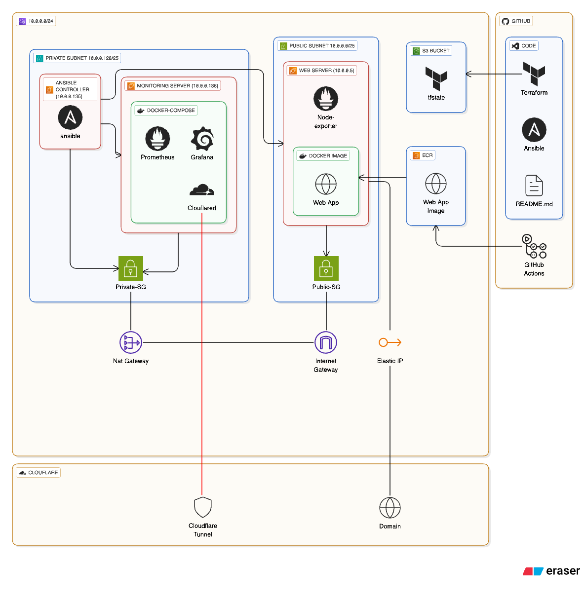

# Project Name : Trust Me, I’m a DevOps Engineer

## 🏗️ 1. Project Overview & Architecture

This project demonstrate a production-style Devops implementation on AWS using Infrastructure As Code (Terraform), configuration management (Ansible), containerization (Docker), monitoring (Prometheus & Grafana) and secure access patterns.

  
  <em>Diagram 1: Architecure Diagram</em>

## 🔗 2. Quick Links

1. [Web application](https://web.cheamirul.site)
2. [Monitoring](https://monitoring.cheamirul.site)
3. [GitHub Repo](https://github.com/cheamirul/devops-bootcamp-project)

## 🛠️ 3. Technical Stack

## ⚙️ 4. Implementation Details

## 🤖 5. CI/CD Pipeline

## 💡 6. Challenges & Solutions
